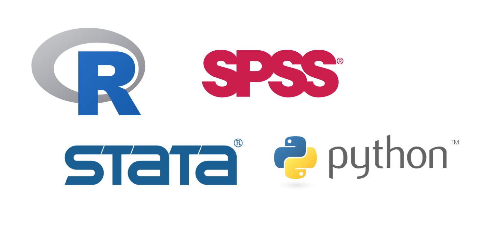

# はじめに {#intro}

## R言語とは

**R言語**とは統計解析に特化した**プログラミング言語**です．Rには大きなコミュニティーが存在し，多くの教科書やオンラインのリソースがあるだけでなく，新しいパッケージが日進月歩開発されています．意外と汎用性もあるので，非常に魅力的な統計プログラミング言語です．

R以外にも**Stata**や**SPSS**などの統計ソフトウェアがあります．しかし，**Stata**や**SPSS**は有料で非常に高額です．大学に在籍している間は使えますが，卒業してから企業で使うのは少し難しいです．対して，Rは**無料**です．なので，長く安心して使うことができます．

たまに，**Python**とR，どちらを使えばいいですかという質問が来ます．その答えは両方です．Pythonの方が汎用性は圧倒的にありますし，とりわけ機械学習などに興味がある場合はPythonの方が便利でしょう．しかし，Pythonで計量分析を行うとなると，Rに比べてコーディングが冗長になるきらいがあります．なので，データを扱う仕事に興味があるのなら，両方を学ぶようにすることが無難です．

```{r eval=FALSE, include=FALSE}
<div style="text-align:center;">

</div>
```
  
```{r echo=FALSE, out.width = '100%', message=FALSE, warning=FALSE, paged.print=FALSE}

```

## RStudioとは

**RStudio**とはRのための**統合開発環境**(IDE)です．IDEとは簡単に言えば，コードを書きやすくするための道具です．単に「R」と言うときは，RStudioを指していることが多いです．


```{r eval=FALSE, include=FALSE}
<div style="text-align:center;">

</div>
```
  
```{r echo=FALSE, out.width = '80%', message=FALSE, warning=FALSE, paged.print=FALSE}
knitr::include_graphics("rstudio.png")
```


## 基本操作

### 四則演算

簡単な計算から始めましょう．コードが書けたら，Windowsの場合は`Ctrl + Enter`，Macの場合は`Command + Return`を入力することで実行(Run)することができます．

```{r collapse = TRUE}
1 + 1   # 足し算
5 - 10  # 引き算
9 * 9   # 掛け算
2 / 3   # 割り算

2 ^ 4   # 累乗
sqrt(9) # 平方根
```
### 文字列

ダブルクォーテーションマークを使って，文字列を扱うことができます．

```{r collapse=TRUE}
"Hello, World!"
"We love Ikuo"
"久米ゼミ"
```


### 割り当て演算

`<-`という割り当て演算子を用いることで，値をオブジェクトとして任意の名前に格納することができます．

```{r collapse=TRUE}
a <- 5
a

b <- 4 + 6
b

a + b

kume <- "LOVE"
kume
```

### ベクトル

`c()`関数を用いて，**ベクトル**をつくることができます．`c`とはcombineのcです．ベクトルとは値の連なりです．Rでは基本的にデータをベクトルとして扱います．ベクトルに含まれる値を**要素**(element)と呼びます．

```{r collapse=TRUE}
vector <- c(1, 2, 3)
vector

tutors <- c("Kitagawa", "Saito", "Ryuman", "Takahashi")
tutors
```

ベクトルに含まれる要素の個数を**長さ**(length)と呼びます．例えば，`c(1, 2, 3)`というベクトルには3つの要素が含まれているので，このベクトルの長さは3です．ベクトルに含まれる要素の個数が大きくなってくると，ベクトルの長さを数えるのが大変です．`length()`関数を用いれば，ベクトルの長さを簡単に確認できます．

```{r collapse=TRUE}
v <- c(1, 2, 3)
length(v)
```

あるオブジェクトがベクトルかどうかを`is.vector()`関数を使って確認できます．次のコードを試してみましょう．

```{r collapse=TRUE}
a <- c(1)
is.vector(a)

b <- 1
is.vector(b)
```

どちらも`TRUE`と出力されますね．実は，`c(1)`と`1`は同じベクトルです．長さ1のベクトルを**スカラー**と呼ぶことにします．

### ベクトルの演算

ベクトルとベクトルの演算を確認します．基本的に，順番が同じ要素の組について
計算して，その値を要素とする新たなベクトルが出力されます．

```{r collapse=TRUE}
x <- c(10, 10, 10)
y <- c(1, 2, 3)

x + y # 足し算
x - y # 引き算
x * y # 掛け算
x / y # 割り算

y ^ 2 # 累乗
sqrt(y) # 平方根

x %*% y # 内積
```

ベクトルとスカラーの演算を確認します．ベクトルとスカラーの演算では，スカラーがベクトルの長さ分だけ繰り返されます．実際に試してみましょう．

```{r}
x <- c(1, 2, 3, 4, 5)
x - 3
```

#### 関数

**関数**を用いることで，さまざまな演算を行うことができます．平方根を求める際に用いた`sqrt()`も関数の一つです．一般に，関数は`f(x)`の形をしています．関数の中に入れる値`x`を**引数**(argument)と呼びます．指定された引数にしたがって，関数は値を出力します．その出力される値のことを**戻り値**(return value)と呼びます．関数の例をいくつか見てみましょう．

```{r collapse=TRUE}
sqrt(100)    # 引数の平方根を出力
round(5.555) # 丸め
date()       # 日時
```

自分で関数を定義することもできます．

```{r collapse=TRUE}
bmi <- function(weight, height){
  index <- weight / height^2
  return(index)
}
bmi(70, 1.7)
```

### csvファイルの読み込み

データセットのファイル形式はcsvであることが多いです．csvファイルは`read.csv`関数で読み込むことができます．さらに，`file.choose()`によって読み込むファイルをGUIで指定することができます．架空のデータセット`wage.csv`を読み込みましょう．[**`wage.csv`はここからダウンロードできます．**](https://drive.google.com/file/d/1s7qyxR7NLt679x9YnJkeC63BEUeXibY3/view?usp=sharing)

```{r eval=FALSE}
mydata <- read.csv(file.choose())
```

```{r echo=FALSE}
mydata <- read.csv("wage.csv")
```

データフレームが格納された名前を実行すると，そのデータフレームの中身を確認できます．しかし，データフレームの名前を実行すると，データフレームの中身が全て出力されるので見づらいです．`head()`関数を用いれば，データフレームのはじめ数行だけを表示することができます．また，`View()`関数を用いると，表形式でデータフレームの中身を確認することもできます．

```{r eval = FALSE}
mydata
head(mydata)
View(mydata)
```

### サブセッティング

Rでは，データセットを**データフレーム**として扱います．データフレームの**列**(column)には名前が付いています．その列名を**変数名**と呼ぶこともあります．列名を見るには`colnames()`関数が便利です．

```{r collapse=TRUE}
colnames(mydata)
```

データフレームの中から，ある変数(列)だけを取り出したい場合があります．その際には，`$`というサブセッティング演算子を用います．`salary`という変数だけを取り出してみましょう．

```{r eval=FALSE}
mydata$salary
```


