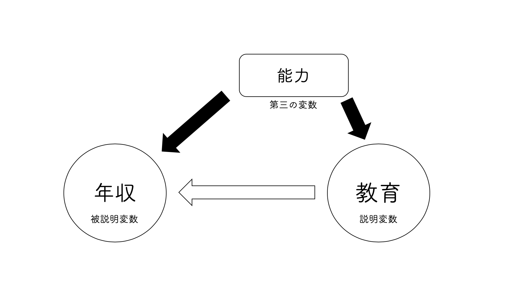
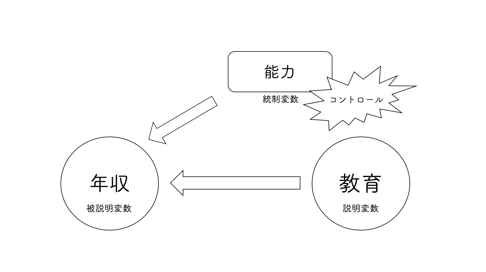

# 回帰分析 {#regression}

本章では，因果推論をするために有用なツールとなる回帰分析を学びます^[本書では，回帰分析と言う場合，線形回帰分析を意味しています]．

## 回帰分析とは

**回帰分析**(regression analysis)とは，大雑把に言うと，2つ以上の変数の関係を方程式で表すことです．例えば，中学数学で習った $y=ax+b$ というような一次方程式をイメージしてください．これは $x$ という変数が0のとき，変数 $y$ は $b$ という値を取り， $x$ が1増えるごとに $y$ が $a$ 増えるという関係を表しています．

```{r echo=FALSE}
plot(1:10, lwd = 0, xlim = c(-3, 20), xaxt='n', yaxt='n',  ylim = c(-3, 20), xlab = "x", ylab = "y")
abline(h=0, lty = "dashed")
abline(v=0, lty = "dashed")
abline(5, 0.8)

segments(0, 0, 0, 5, col = "red", lwd = 3)
arrows(0, 5, 7, 5, length = 0.1)
arrows(7, 5, 7, 10.6, length = 0.1, col = "blue", lwd = 3)
text(0.7320603, 2.302648, labels = "b", col = "red")
text(7.839979, 7.677902,labels = "a", col = "blue")
text(3.451927,5.938849, labels = "1")
text(15.38308, 15.37189, labels = "y = ax + b")
text(-0.5, -0.5, labels = "O")
```


回帰分析とは，ある変数と変数の関係性が$y=ax+b$というような方程式で表現できる仮定して，その係数$a$や切片$b$を手元のデータから推定することを言います．特に，そのような関係式のことを**回帰式**と呼びます．回帰式のことを**統計的モデル**または単に**モデル**ということもあります．

このとき，左辺にある変数を**被説明変数**(explained variable)と呼びます．基本的に，回帰式に従属変数は1つだけ含まれます．対して，右辺にある変数を**説明変数**(explanatory variable)と呼びます．説明変数は1つ以上回帰式に含めることができます．

## 単回帰分析

**単回帰分析**(simple linear regression)とは，回帰式に説明変数が1つだけ含まれる回帰分析のことを指します．慣習的に，回帰式は次の通りに書かれることが多いです．

$$
y = \beta_0 + \beta_1x + \varepsilon
$$

$y$が被説明変数，$\beta_0$が**定数項**(切片)，$\beta_1$が説明変数$x$の係数です．回帰式の係数のことを特に**回帰係数**と呼びます．

さて，新しく追加された$\varepsilon$とは何でしょうか．これは**誤差項**と呼ばれるもので，確率的に生じる誤差を表しています．社会科学において観察される変数と変数の関係は，$y = \beta_0 + \beta_1x$というような方程式で完全に表現できることはあまりありません．

例えば，わたしたちは今，教育年数(educ)と年収(salary)の関係に興味があるとしましょう．回帰分析の結果，どうやら$salary=300+30educ$であるとわかったとします^[これは架空の回帰分析です．]．このことは，教育年数が2年の人はみんながみんな年収360万円であるということを意味するでしょうか？そんなことは直感的にもありえませんね．教育年数が同じ人の間でも，何らかの誤差が生じていて年収は多かれ少なかれ異なると考えるのが自然です．その誤差を捉えるのが$\varepsilon$です．

では，教育年数が同じ人の間でも何らかの誤差が生じていて年収が異なるのであれば，$salary=300+30educ$は無意味な数式なのでしょうか．それは違います．その式が表しているのは，「教育と年収には，平均的にこの関係があるようだ」ということです．大雑把に言うと，教育年数が2年の人はみんながみんな年収360万円ではないけれど平均的にはそのくらいだ，ということになります．これが回帰分析の基本的なアイディアです．このアイディア自体は重回帰分析でも共通です．


```{r echo=FALSE, message=FALSE, warning=FALSE, paged.print=FALSE}
set.seed(1)
x <- round(runif(10, 0, 16))
y <- 300 + 30 * x +rnorm(10, 0, 130)
result <- lm(y ~ x)
plot(x, y, lwd = 1, pch = 20, xlim = c(0, 25),  ylim = c(-3, 900), xlab = "Years of Education", ylab = "Salary [Yen]")
abline(result, lwd = 1)
segments(x[2], y[2], x[2], result$fitted.values[2], col = "red")
segments(x[3], y[3], x[3], result$fitted.values[3], col = "red")
segments(x[9], y[9], x[9], result$fitted.values[9], col = "red")
segments(x[8], y[8], x[8], result$fitted.values[8], col = "red")

text(6.461107, 539.3121,labels = expression(paste(epsilon)), col = "red", cex = 1.5)
text(9.378066,643.0075, labels = expression(paste(epsilon)), col = "red", cex = 1.5)
text(10.56062,375.9132, labels = expression(paste(epsilon)), col = "red", cex = 1.5)
text(11.46724,608.4424, labels = expression(paste(epsilon)), col = "red", cex = 1.5)
text(18.44429,806.4064, labels = expression(paste(y == beta[0], "+", beta[1], "x")))
abline(h=0, lty = "dashed")
abline(v=0, lty = "dashed")
```


## 最小二乗法

ある変数とある変数の関係を，理論的な考察によって，$y=\beta_0+\beta_1x+\varepsilon$という回帰式でモデル化できそうだということがわかっているとしましょう．しかし，このときどのようにして$\beta_0$や$\beta_1$の値を知ることができるでしょうか．結論を言うと，$\beta_0$や$\beta_1$の本当の値を知ることは決してできません．なぜなら，わたしたちが観察できるのは，$y=\beta_0+\beta_1x+\varepsilon$というモデルに従って発生した具体的なデータ$(y_i, x_i)$だけだからです．

$\beta_0$や$\beta_1$の本当の値を知ることはできませんが，手元にある具体的なデータ$(y_i, x_i)$から，$\beta_0$や$\beta_1$の値を推測することは可能です．$\beta_0$や$\beta_1$の値を推測することを**推定**(estimation)と言います．なお，推定するための計算式(関数)を**推定量**(estimator)と呼びます．その計算式によって算出された実際の値を**推定値**(esitmate)と呼びます．

次の具体的なデータを例に考えてみましょう．今，わたしたちは学生の1ヶ月あたりの書籍購入費とGPAの関係に興味があるとします．このとき，入手したデータが次の散布図を描きました．どのような関係が見て取れるでしょうか？^[実際には，このデータは打ち切りデータなので，Tobitを用いることが適切ですが，簡単のためここでは打ち切りによるバイアスは生じないものと仮定しましょう．]

```{r echo=FALSE}
set.seed(1)
x <- round(runif(100, min = 0, max = 20000))
y <- 2 + 0.0002 * (x - mean(x)) + rnorm(100, 0, 0.5)
y[order(y)][1:7] <- 0
y[order(y)][98:100] <- 4
plot(x, y, ylim = c(-1, 4.5), xlim = c(-1, 22000), ylab = "GPA", xlab = "Spending on Books", pch = 20)
abline(h=0, lty = "dashed")
abline(h=4, lty = "dashed")
```

右上がりの関係が見て取れますね．

さて，わたしたちは，$y=\beta_0+\beta_1x+\varepsilon$という回帰式を仮定している訳ですが，それはつまり，「観測されるデータは$y=\beta_0+\beta_1x$という直線の関係に平均的に従うはずだ」と考えているということです．

ひるがえって，「観測されたデータがいかにも従っていそうな直線」を描くことができれば，$\beta_0$や$\beta_1$の値を推定することができそうですね．では，「観測されたデータがいかにも従っていそうな直線」とはどのような直線でしょうか？

ものは試しです．いくつか直線を引いてみました．以下の4つの中で，どれが最も「観測されたデータがいかにも従っていそうな直線」だと思いますか？

```{r echo=FALSE, out.width = '50%'}
## 
par(mar = c(4, 4, 1.5, 0.1))

set.seed(1)
x <- round(runif(100, min = 0, max = 20000))
y <- 2 + 0.0002 * (x - mean(x)) + rnorm(100, 0, 0.5)
y[order(y)][1:7] <- 0
y[order(y)][98:100] <- 4
plot(x, y, ylim = c(-1, 4.5), xlim = c(-1, 22000), ylab = "GPA", xlab = "Spending on Books", pch = 20, main = "1")
abline(h=0, lty = "dashed")
abline(h=4, lty = "dashed")
abline(3.5, -0.0001, col = "red")

set.seed(1)
x <- round(runif(100, min = 0, max = 20000))
y <- 2 + 0.0002 * (x - mean(x)) + rnorm(100, 0, 0.5)
y[order(y)][1:7] <- 0
y[order(y)][98:100] <- 4
plot(x, y, ylim = c(-1, 4.5), xlim = c(-1, 22000), ylab = "GPA", xlab = "Spending on Books", pch = 20, main = "2")
abline(h=0, lty = "dashed")
abline(h=4, lty = "dashed")
abline(lm(y ~ x), col = "red")

set.seed(1)
x <- round(runif(100, min = 0, max = 20000))
y <- 2 + 0.0002 * (x - mean(x)) + rnorm(100, 0, 0.5)
y[order(y)][1:7] <- 0
y[order(y)][98:100] <- 4
plot(x, y, ylim = c(-1, 4.5), xlim = c(-1, 22000), ylab = "GPA", xlab = "Spending on Books", pch = 20, main = "3")
abline(h=0, lty = "dashed")
abline(h=4, lty = "dashed")
abline(0.8, 0.0002, col = "red")

set.seed(1)
x <- round(runif(100, min = 0, max = 20000))
y <- 2 + 0.0002 * (x - mean(x)) + rnorm(100, 0, 0.5)
y[order(y)][1:7] <- 0
y[order(y)][98:100] <- 4
plot(x, y, ylim = c(-1, 4.5), xlim = c(-1, 22000), ylab = "GPA", xlab = "Spending on Books", pch = 20, main = "4")
abline(h=0, lty = "dashed")
abline(h=4, lty = "dashed")
abline(h = 1, col = "red")
```

これは一目瞭然，簡単ですね．2番目が最も「観測されたデータがいかにも従っていそうな直線」だと誰しもが答えると思います．なぜなら，この中で最もいい感じにフィットしているからです．

それでは次の場合はどうでしょうか？どれが最も「いい感じにフィットしている」でしょうか？

```{r echo=FALSE, out.width = '50%'}
## 
par(mar = c(4, 4, 1.5, 0.1))
set.seed(1)
x <- round(runif(100, min = 0, max = 20000))
y <- 2 + 0.0002 * (x - mean(x)) + rnorm(100, 0, 0.5)
y[order(y)][1:7] <- 0
y[order(y)][98:100] <- 4
plot(x, y, ylim = c(-1, 4.5), xlim = c(-1, 22000), ylab = "GPA", xlab = "Spending on Books", pch = 20, main = "1")
abline(h=0, lty = "dashed")
abline(h=4, lty = "dashed")
abline(-1, 0.0003, col = "red")

set.seed(1)
x <- round(runif(100, min = 0, max = 20000))
y <- 2 + 0.0002 * (x - mean(x)) + rnorm(100, 0, 0.5)
y[order(y)][1:7] <- 0
y[order(y)][98:100] <- 4
plot(x, y, ylim = c(-1, 4.5), xlim = c(-1, 22000), ylab = "GPA", xlab = "Spending on Books", pch = 20, main = "2")
abline(h=0, lty = "dashed")
abline(-0.7, 0.0002, col = "red")

set.seed(1)
x <- round(runif(100, min = 0, max = 20000))
y <- 2 + 0.0002 * (x - mean(x)) + rnorm(100, 0, 0.5)
y[order(y)][1:7] <- 0
y[order(y)][98:100] <- 4
plot(x, y, ylim = c(-1, 4.5), xlim = c(-1, 22000), ylab = "GPA", xlab = "Spending on Books", pch = 20, main = "3")
abline(h=0, lty = "dashed")
abline(h=4, lty = "dashed")
abline(0.8, 0.00015, col = "red")

set.seed(1)
x <- round(runif(100, min = 0, max = 20000))
y <- 2 + 0.0002 * (x - mean(x)) + rnorm(100, 0, 0.5)
y[order(y)][1:7] <- 0
y[order(y)][98:100] <- 4
plot(x, y, ylim = c(-1, 4.5), xlim = c(-1, 22000), ylab = "GPA", xlab = "Spending on Books", pch = 20, main = "4")
abline(h=0, lty = "dashed")
abline(h=4, lty = "dashed")
abline(h=4, lty = "dashed")
abline(lm(y ~ x), col = "red")

```

微妙なところですが，多くの人はなんとなく4番が最も「いい感じにフィットしている」と答えるのではないでしょうか？しかし，何人かは「わからないやあ」と答えるかもしれません．もし，あなたも4番が最も「いい感じにフィットしている」と感じたのであれば，そのような優柔不断な人々にどのように説明しますか？

優柔不断な人々を説得するためには，「いい感じにフィットしている」というやや曖昧な表現をもう少し明確な言葉で言い換える必要があるでしょう．「いい感じにフィットしている」というのは，どのような言葉で明確に言い換えられるでしょうか．少し考えてみましょう．

「いい感じにフィットしている」というのは，「直線がどの点に対してもなるべく近い」ということを意味していると思います．その基準にのっとれば，4番が最も「いい感じにフィットしている」と説得的に説明できるのではないでしょうか．「直線がどの点に対してもなるべく近い」というのを$\beta_0$や$\beta_1$の値を推定するときの基準として採用しましょう．

「直線がどの点に対してもなるべく近い」という基準にのっとって，$\beta_0$や$\beta_1$の推定値を計算する方法を**最小二乗法**(ordinary least squares)と呼びます．「直線がどの点に対してもなるべく近い」という基準をもう少し数学的に厳密に定義して直線を求める方法です．すなわち，次のように定義される$\widehat{\beta}_0$と$\widehat{\beta}_1$を，$\beta_0$や$\beta_1$の値を推定する関数として採用する方法です．

$$
\begin{eqnarray}
\DeclareMathOperator*{\argmin}{argmin}
 (\widehat{\beta}_0,\widehat{\beta}_1) &=& \argmin_{\beta_0,\beta_1} \ \sum_{i=1}^n \ \{ \ y_i-\beta_0-\beta_1x_i \ \}^2
\end{eqnarray}
$$

これを手計算で求めるのはあまり楽ではありません．どれほど計算が得意な人でも，かなりの時間がかかってしまいます．そんなときこそ，Rの出番です．Rでは簡単なコードを書くだけで，$\beta_0$や$\beta_1$を最小二乗法によって推定することができます．

最小二乗法による回帰を行うためには，`lm()`関数を用います．`lm()`関数には，主に2つの引数があります．`data`と`formula`です．

`data`には用いるデータフレームを指定します．`formula`には回帰式を指定します．回帰式を表現するには`~`(チルダ，tilde)を用います．左には被説明変数を書き，右には説明変数を書きます．例えば，$(x_i, y_i)$に対して$y=\beta_0+\beta_1x+\varepsilon$というモデルを仮定している場合，`y ~ x`のようにして回帰式を指定します．

`lm()`関数を割り当て演算子によって，オブジェクトとして名前に格納しておくと，最小二乗法による推定結果のさまざまな情報がその名前に記録されます．`ols`を実行すると，定数項と係数の推定値が出力されます．

```{r collapse=T}
ols <- lm(formula = salary ~ educ, data = mydata)
ols
```

このデータの場合，$\beta_0$は`r round(ols$coefficient[1], 2)`，$\beta_1$は`r round(ols$coefficient[2], 2)`と推定されていることがわかります．この場合，教育年数が1年増えると，年収が平均的に70万円増える(傾向がある)と解釈するのでしたね．定数項については解釈をすることはあまりありません．

`plot()`関数によって散布図を描いた後に，`abline()`関数を用いて，推定された回帰直線を描くことができます．データに対して「いい感じにフィットしている」ことを確認してください．

```{r}
plot(mydata$educ, mydata$salary)
abline(ols)
```

## 重回帰分析

**重回帰分析**(simple linear regression)とは，単回帰分析を拡張した分析方法で，回帰式に説明変数が2つ以上含まれる回帰分析のことを指します．回帰式は次の通りに書かれます．ここでは，説明変数が2つの場合を考えましょう．説明変数は$x_1$と$x_2$の2つです．

$$
y = \beta_0 + \beta_1 x_1 + \beta_2 x_2 + \varepsilon
$$

説明変数が増えたこと以外は，単回帰分析とアイデアは同じで，最小二乗法によりモデルを推定することができます．説明変数が2つの場合には，3次元空間上の散布図に「いい感じにフィットする平面」を描くことに対応します．が，あまり難しいことは考えずに，単回帰分析の強化版だと思ってください．「3次元空間上の散布図にいい感じにフィットする平面」というのは，以下の図のようなイメージです．

```{r  echo = FALSE, message=FALSE, warning=FALSE}

library(plotly)
# fit model
m <- lm(salary ~ educ + age, data = mydata)

# predict over sensible grid of values
Educ <- unique(mydata$educ)
Age <- unique(mydata$age)
grid <- with(mydata, expand.grid(Age, Educ))
d <- setNames(data.frame(grid), c("age", "educ"))
vals <- predict(m, newdata = d)

# form matrix and give to plotly
Salary <- matrix(vals, nrow = length(unique(d$age)), ncol = length(unique(d$educ)))

plot_ly(x=mydata$educ, y=mydata$age, z=mydata$salary, type="scatter3d", mode="markers", color=mydata$salary, size = 0.1) %>% 
  add_surface(x = ~Educ, y = ~Age, z = ~Salary, col = 3) %>%layout(
    title = "3D Scatterplot and Regression Plane")

```

最小二乗法による重回帰分析もRで簡単に行えます．単回帰分析の場合と同様に，`lm()`関数を用います．`+`を使って回帰式を指定することで説明変数を2つ以上入れることができます．ここでは`salary`を`educ`と`iq`に回帰してみましょう．

```{r collapse=TRUE}
multiple <- lm(salary ~ educ + iq, data = mydata)
multiple
```

単回帰分析のときと同様に，定数項や係数の推定値が求められました．重回帰分析の場合は，少しだけ解釈の仕方が変わります．重回帰分析の場合は，
「教育年数が1年増えると，他の変数(この場合`iq`)が変化しないならば，年収が`r round(multiple$coefficient[2], 2)`万円増える」と解釈します．この「他の変数が変化しないならば」という但し書きが重要です．「他の変数が変化しない」という条件のことを，**セテリスパリブス**(ceteris paribus)と言います．また，`iq`に関しても，`iq`が1単位増えると，セテリスパリブスで，年収が`r round(multiple$coefficient[2], 3)`増えるとも解釈できます．

## 回帰分析と因果推論

さて，繰り返しになってしまいますが，単回帰分析と重回帰分析の違いは説明変数が1つしかないのか2つ以上あるのかどうかだけです．それでは重回帰分析をすると何が嬉しいのでしょうか？単回帰分析をそれぞれの説明変数について行うのと何が違うのでしょうか？

それを考えるためには，因果関係の3条件を思い出しましょう．

1. 説明変数と被説明変数の間に共変関係がある．(共変関係)
2. 説明変数の変化は被説明変数の変化の前に生じている．(時間的先行)
3. 他の変数を統制(コントロール)しても(他の変数の値を固定しても)共変関係が観察される．(他の変数の統制)

以上3つでしたね(久米 2013, p.15)．

回帰分析によって達成できるのは，因果関係の3条件のうち，1と3です．本章では簡単のため，2の時間的先行は満たされていると仮定しましょう．**共変関係**とは，ある値が変化すると，別のある値も変化するような関係を言いました．共変関係があるかどうかは散布図や相関係数によって確かめれば十分であることも多いですが，単回帰分析によって調べることもできます．単回帰式を推定して，説明変数の回帰係数の推定値が0でなければ共変関係があると言えるでしょう．

しかし，社会科学の分野では，それだけでは因果関係があると言うのに不十分であることが通常です．因果関係の3条件の
3番目である「他の変数の統制」が満たされないことが多いからです．つまり，**第三の変数**が存在しているかもしれないということです．ここで言う第三の変数とは，説明変数にも被説明変数にも影響を与えている変数のことを指します．

例えば，教育と所得の関係を考えてみましょう．教育が所得に与える影響を見たいとします．このときに考えられる第三の変数として，"能力"が挙げられます．そもそも能力が高いから，良い教育を受けているのであって，そもそも能力が高いから良い所得を有しているということが考えられます．

```{r echo=FALSE, out.width = '100%', message=FALSE, warning=FALSE, paged.print=FALSE}

```

もし教育と能力が相関していれば，良い教育を受ける人は能力が高い傾向にあることになります．そして，もし能力と年収が相関していれば，能力が高い人は所得が高い傾向にあるということになりますね．すなわち，教育は所得に直接的に与える影響と，能力を経由して間接的に与えている(ように見える)影響とを持っていると考えることができます．

このとき，所得と教育の単回帰分析を行うとどうなるでしょうか．結論を言うと，教育の回帰係数の推定値は，教育の直接的な影響だけでなく，能力の影響まで含んでしまいます．それでは，教育の本当の効果を推測することができません．第三の変数が存在しているとき，その推定は**バイアス**がかかっています．今回の例に即すれば，推定値は上方にバイアスがかかっていることが想定されるでしょう．

このようなときに重回帰分析が役に立つのです．重回帰分析では2つ以上の説明変数をモデルに組み入れることができました．それによって，セテリスパリブス(他の変数が変化しないという条件)における効果を推定することができるのでしたね．もしも，能力という変数が観測できるのであれば，それをモデルに組み込むことでその影響を捉えて，教育の効果から分離することができます．このように，関心のある説明変数(ここでは教育！)を正確に推定するために他の変数をモデルに組み入れることを，他の変数を**統制**(control)すると言います．統制される変数は**統制変数**と呼ばれます．

```{r echo=FALSE, out.width = '100%', message=FALSE, warning=FALSE, paged.print=FALSE}

```

このように，重回帰分析の利点は他の変数を統制することで，関心のある説明変数の効果を正しく推定することができるのです．すなわち，重回帰分析とは，因果関係の3つの条件の3番目を満たすための有力なツールなのです．

実際に回帰分析をしてみましょう．`mydata`には年収`salary`と教育年数`educ`に加えて，能力`abili`という変数があります．いま，わたしたちは教育年数が年収に与える影響に関心があるとします．まずは，単回帰分析をしてみましょう．

```{r collapse = TRUE}
simple <- lm(formula = salary ~ educ, data = mydata)
simple
```

教育年数が1年増えると，年収が`r round(simple$coefficient[2], 2)`万円増えるということがわかります．しかし，先ほども話した通り，能力という第三の変数が推定にバイアスをかけている可能性があります．そこで，`abili`を統制変数として追加して重回帰分析をしてみましょう．

```{r collapse = TRUE}
multiple <- lm(salary ~ educ + abili, data = mydata)
multiple
```

能力について統制すると，`educ`の係数が`r round(simple$coefficient[2] - multiple$coefficient[2], 2)`ほど小さくなりましたね．やはり，単回帰分析では，能力を経由した間接的な効果を，教育の効果であるとバイアスのかかった推定をしていたようです．

以上のように，因果関係の3条件の3番目「他の変数の統制」を，重回帰分析を用いることで満足することができるのです．ただし，重回帰分析が第三の変数の問題を解決できるのは，その第三の変数を観察できるとき，すなわちその**データが入手できるとき**に限ります．例えば，本来，能力というような抽象的な変数は観察できません．

そこでしなくてはならないのが，**操作化**(operationalization)です^[計量経済学における操作変数法(instrumental variable method)とは異なります．]．すなわち，他の観察可能な変数によって観察不可能な変数を代替するということです．そのような変数を**代理変数**(proxy variable)と呼びます．

例えば，能力を知識であると捉えて，それをIQなどの指標で代替できるかもしれません．IQを能力の代理変数として用いるわけです．`mydata`には`iq`という変数があります．ここでは，`abili`が観察されなかったと仮定して，`iq`を代理変数として用いてみましょう．

```{r collapse=T}
ols <- lm(formula = salary ~ educ + iq, data = mydata)
ols
```

`salary ~ educ + abili`の結果からは少しだけずれますが，これは代理変数が測定の誤差を含んでいることに起因する分析の誤差であると考えられます．とはいえ，ほとんど変わらないので，今回の場合は代理変数がある程度しっかりと代理していると言えそうです．

代理変数を用いるときには，それが正しく本来の変数を代理しているかどうかを検討することが大事です．理想的には，代理変数と本来の変数が強く相関していることが望ましいです．しかし，本来の変数はそもそも観察不可能なわけですから理論や直観に基づいて検討する他ありません．代理変数を用いる際には，気をつけましょう．

```{exercise}
次の問いに答えましょう．

1. 単回帰分析と重回帰分析の違いは何ですか？
2. 単回帰分析の限界は何ですか？
3. 最小二乗法とは何ですか？わかりやすく説明してください．
```


