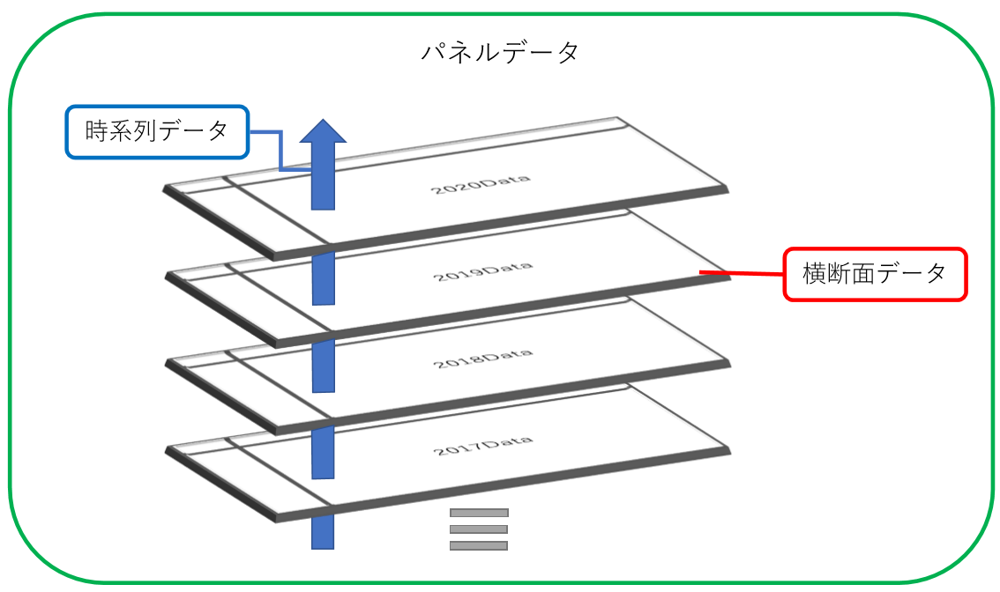

# 回帰分析のテクニック (準備中) {#regtech}

**本章は未完成です**

本章では，回帰分析の際に有用なテクニックを紹介します．

## ダミー変数

### ダミー変数ってなんだ？

**ダミー変数(Dummy Variable)**とは，ある特定の条件を満たす場合は1，その条件を満たさない場合は0をとる変数です．**二値変数**とも呼ばれます

早速具体例を見てみましょう．

$$
female_i = \begin{cases} 1 & \mbox{if } i\mbox{ is a female} \\ 0 & \mbox{if } i\mbox{ is not a female} \end{cases}
$$

変数$female$は，「個人$i$がもし女性であれば1，女性でないならば0」をとるダミー変数です ^[ほとんどの場合，変数の名前に1をとる条件が表れています．例えば，$married$というダミー変数は，「結婚していれば1，独身であれば0をとる変数」であると解釈します．]．

### ダミー変数を用いた分析

実際にダミー変数を用いた重回帰分析を行ってみましょう．いま，「性別によって賃金($salary$)が異なる」という仮説を検証したいとしましょう．

仮説の検証のためにチャプター3で用いたモデルに$female$というダミー変数を追加して回帰分析を行います．モデル式は以下のように書くことができます．

$$
salary \ = \ {\beta}_0 +  {\beta}_1educ + {\beta}_2age + {\beta}_3exper + {\beta}_4iq + {\beta}_5female + {\varepsilon}
$$

この式で$female$は1か0のいずれかの値をとります．ここである個人が女性でない場合($female = 0$)を考えてみましょう．モデル式に$female = 0$を代入するのでその項は消えてしまいますね．

$$
\begin{align}　\
salary \ &= \ {\beta}_0 +  {\beta}_1educ + {\beta}_2age + {\beta}_3exper + {\beta}_4iq + {\beta}_5{\times}0 + {\varepsilon}\\
&= \ {\beta}_0 +  {\beta}_1educ + {\beta}_2age + {\beta}_3exper + {\beta}_4iq + {\varepsilon}
\end{align}
$$

では逆にある個人が女性である場合($female = 1$)を考えてみましょう．モデル式に$female = 0$を代入してみます．

$$
\begin{align}　\
salary \ &= \ {\beta}_0 +  {\beta}_1educ + {\beta}_2age + {\beta}_3exper + {\beta}_4iq + {\beta}_5{\times}1 + {\varepsilon}\\
&= \ ({\beta}_0 + {\beta}_5) +  {\beta}_1educ + {\beta}_2age + {\beta}_3exper + {\beta}_4iq + {\varepsilon}
\end{align}
$$
$female$の係数である${\beta}_5$はそのまま残り，定数項${\beta}_0$と足し合わせて新たな定数項$({\beta}_0+{\beta}_5)$を作り出しています．すなわち，$female$の係数は女性である場合とそうでない場合の切片の差であると解釈ができます．

これを実際に分析してみましょう．コードは以下の通りに書くことができましたね．

```{r, echo=T, warning=F, message=FALSE}
mydata <- read.csv("wage2.csv")
```

```{r, warning=FALSE, comment=""}
result <- lm(formula = salary ~ educ + age + exper + iq + female, data = mydata)
summary(result)
```

結果を見ると，`female`は5%水準で統計的有意性を示してはいません．すなわち，「他の変数を一定としたときに，女性であることは賃金`salary`に影響を与えているとは言えない」という結論を得ることができます．
 
### ダミー変数を用いるメリットとデメリット

ダミー変数を用いることにはどのようなメリットがあるでしょうか．一方で，安易にダミー変数を使うことによる問題は起こらないのでしょうか．

メリットの方からまとめておきます．メリットとしては係数の解釈や，そこから得られるインプリケーションが明確であることが挙げられるでしょう．「既婚者であれば1, と独身者であれば0」をとるようなダミー変数として表して分析を行った場合，その結果におけるダミー変数の係数は「独身の人が結婚した場合に得られる影響そのもの」です．ダミー変数は0か1で対象を二つに分割するため，0と1の差だけ考えればよいという意味で解釈は容易でしょう．

一方，安易にダミー変数を使ってしまうと問題が起こる可能性もあります．例えば「その国が民主主義体制なら1，権威主義体制なら0」というダミー変数を作って分析を行ったとします．確かにこの変数を使えば体制による従属変数への影響は明らかになるでしょう．しかしながら，一言に民主主義体制/権威主義体制と言ってもその中には様々な程度があります．ダミー変数ではこれらの差異までは表すことはできません．この代わりにFreedom House^[https://freedomhouse.org/]の7点評価や，Polity IV Project^[https://www.systemicpeace.org/polity/polity4.htm]の10点評価の民主主義指数(Polity指数)で分析を行うことができれば，民主主義体制の国がさらに民主的になった場合や，権威主義体制の国がさらに権威主義を強めた場合の影響もとらえることができます．このようにダミー変数は，本来であれば測定できる影響を捨象してしまう可能性も含んでいる，「情報量の少ない変数」ということもできるでしょう．

## 交差項

### 交差させると見えてくる

これまで重回帰分析を学び，ダミー変数まで扱えるようになりました．新たに**交差項**（interaction term）という分析のツールを習得しましょう．

交差項とは，変数同士を掛け合わせた変数のことをいいます．実際に交差項を入れたモデルの式を見てみましょう．

$$
salary \ = \ {\beta}_0 +  {\beta}_1educ + {\beta}_2age + {\beta}_3exper + {\beta}_4female + {\beta}_5(educ{\times}female)+ {\varepsilon}
$$

この$(educ*female)$の項を交差項と呼びます．この項は何を表し，係数はどのように解釈をすればよいのでしょうか．交差項のタイプ別にみていくこととします．

交差項は非常に強力なツールです．使いこなせて損はありませんが，その係数をどう解釈すればよいのかが時に複雑に思えるときがありますので，モデル式から「係数が何を表すのか」を確認しておきましょう．

### ダミー変数 × 量的変数

ダミー変数と連続変数の交差項を考えてみます．例えば以下の交差項はダミー変数×連続変数の交差項です．

$$
salary \ = \ {\beta}_0 +  {\beta}_1educ + {\beta}_2age + {\beta}_3exper + {\beta}_4female + {\beta}_5(educ{\times}female)+ {\varepsilon}
$$

$female$はこれまでの通り「女性であれば1, 女性でなければ0」という値をとるダミー変数です．一方で$educ$はその人の受けた教育年数を表す量的変数です．この変数はどのような意味を持ち，係数はどのように解釈をすることができるでしょうか．$female$が1をとる場合と$female$が0をとる場合でモデルがどのように変化をするか見てみましょう．

まずは$female$が1をとる場合は以下のように計算できますね．

$$
\begin{align}　\
salary \ &= \ {\beta}_0 +  {\beta}_1educ + {\beta}_2age + {\beta}_3exper + {\beta}_4{\times}1 + {\beta}_5(educ{\times}1) + {\varepsilon}\\
&= \ ({\beta}_0 + {\beta}_4) +  ({\beta}_1 +  {\beta}_5)educ + {\beta}_2age + {\beta}_3exper + {\varepsilon}
\end{align}
$$

${\beta}_5$は前節で見た通り，定数項とまとめることができます．そして${\beta}_6$は$educ$でくくることができ，$educ$の新たな係数として$({\beta}_1 + {\beta}_6)$が現れます．交差項の係数${\beta}_6$は，女性である場合$(female = 1)$と女性でない場合$(female = 0)$の変数$educ$の従属変数に与える影響の違いである，と考えることができます．

もしこの交差項の係数が有意に正の値をとるとすれば，「教育年数が一年増加することによる賃金への影響は男性より女性の方が大きい」ということになります．逆にこの係数が負の値をとるとすれば，「女性の場合は教育年数が一年増加しても，男性ほどは賃金が上がらない」と解釈することができます．

それでは具体的にこのモデルで分析をしてみましょう．

```{r, echo=F, message=FALSE, warning=FALSE}
library(ggplot2)
mydata <- read.csv("wage2.csv")
```

```{r, comment=""}
lm1 <- lm(formula = salary ~ educ + age + exper + female + educ*female, data = mydata)
summary(lm1)
```

結果を見ると，10%の有意水準でしか差があることを言えないので，社会科学においては統計的に有意ではないと結論付けることになります．しかし，一応傾向としてだけでもいえることを言っておくと，`female`の変数は有意に負の結果が出ています．これは，女性であることは賃金に負の影響を与えるという結果です．

そして今回の関心である`educ:female`の交差項を観察すると，正に有意である傾向を見て取る頃ができます(10%)．これは，「女性が教育年数を1年増加させたときに起こる賃金の上昇は，男性より大きい」というように解釈ができます．

より詳しく見てみます．数式に実際に推定された値を入れて，$female$が1の場合と0の場合を考えましょう．

$$
\begin{align}　\
salary \ &= \ -62.588 +  64.348educ + 3.711age + 0.171exper -156.200female + 11.091(educ{\times}female) + {\varepsilon}\\
&= \ (-62.588 -156.200) +  (64.348 + 11.091)educ + 3.711age + 0.171exper + {\varepsilon} \ \ \ (if \ female =1)\\
&= \ -62.588 +  64.348educ + 3.711age + 0.171exper + {\varepsilon} \ \ \ (if \ female =0)
\end{align}
$$

それぞれの差が定数項と`educ`の係数の差となって表れていますね．男性の場合教育年数を1年増加させたときにおこる賃金の上昇は`64.348`ですが，女性の場合は`64.348 + 11.091 = 75.439`の上昇があると推定されているということです．

グラフで見るとよりわかりやすくなるでしょう．

```{r}
# in preparation
```

### ダミー変数 × ダミー変数

次はダミー変数同士を掛け合わせたモデルを考えてみましょう．以下のモデルは$female$というダミー変数と$married$(既婚であれば1, 独身であれば0)をとるダミー変数を掛け合わせた交差項をモデルに組み込んでみましょう．モデルは以下の通りに書くことができます．

$$
salary \ = \ {\beta}_0 +  {\beta}_1educ + {\beta}_2age + {\beta}_3exper + {\beta}_4female + {\beta}_5married + {\beta}_6(female{\times}married) + {\varepsilon}\\
$$

この二つのダミー変数がどのように変化するかを考えてみましょう．世の中には「女性の既婚者」「女性の独身者」「男性の既婚者」「男性の独身者」の4つのタイプが存在しますね．それぞれでダミー変数がどのような値をとるか考えてみましょう．

まず，ためしに「男性の独身者」を考えてみます．男性なので$female$は0です．そして独身者なので$married$も0をとります．これらを代入するとモデル式は以下の通りになります．

$$
\begin{align} \\
salary \ &= \ {\beta}_0 +  {\beta}_1educ + {\beta}_2age + {\beta}_3exper + {\beta}_4{\times}0 + {\beta}_5{\times}0 + {\beta}_6(0{\times}0) + {\varepsilon}\\
&= \ {\beta}_0 + {\beta}_1educ + {\beta}_2age + {\beta}_3exper + {\varepsilon}
\end{align}
$$

次に「女性の既婚者」を考えます．女性なので$female$は1をとり，既婚者なので$married$も1です．このときモデルは以下のように書くことができます．

$$
\begin{align} \\
salary \ &= \ {\beta}_0 +  {\beta}_1educ + {\beta}_2age + {\beta}_3exper + {\beta}_4{\times}1 + {\beta}_5{\times}1 + {\beta}_6(1{\times}1) + {\varepsilon}\\
&= \ ({\beta}_0 + {\beta}_4 +{\beta}_5 +{\beta}_6) + {\beta}_1educ + {\beta}_2age + {\beta}_3exper + {\varepsilon}
\end{align}
$$

すなわち「男性の独身者」と「女性の既婚者」の賃金は，$({\beta}_4 + {\beta}_5 + {\beta}_6)$の値だけ異なると言えるでしょう．

このようにダミー変数×ダミー変数の交差項はその係数の解釈が少々複雑です．以下にそれぞれのタイプの効果をまとめておきます．

| グループ | 固有の係数 |
| -------  | ---- |
| 独身男性$(female = 0, \ married = 0)$ | ${\beta}_0$ |
| 既婚男性$(female = 0, \ married = 1)$ | ${\beta}_0 + {\beta}_5$ |
| 独身女性$(female = 1, \ married = 0)$ | ${\beta}_0 + {\beta}_4$ |
| 既婚女性$(female = 1, \ married = 1)$ | ${\beta}_0 + {\beta}_4 + {\beta}_5 + {\beta}_6$ |


では実際に分析を行ってみましょう．

```{r, comment=""}
lm2 <- lm(formula = salary ~ educ + age + exper + female + married + female*married, data = mydata)
summary(lm2)
```

結果より，`married`は統計学的な有意性を示しますが，`female`と交差項`female:married`は統計的有意性を示していません．この結果はどのように解釈ができるでしょうか？

まず`married`は正に有意なので，既婚者は独身者より賃金が高いという結論を得ることはできます．その一方で，`female`は有意ではないため，性別による賃金の差はないと考えられます．以上から「既婚状態は賃金に正に有意であるが，性別は賃金に有意な差を与えない」と結論できます．


### 量的変数 × 量的変数

これまでダミー変数を用いた交差項について書いてきましたが，ダミー変数ではないもので交差項を作ることも可能です．例えば以下のようなモデルです．

$$
salary \ = \ {\beta}_0 +  {\beta}_1educ + {\beta}_2age + {\beta}_3exper + {\beta}_4female + {\beta}_5(educ{\times}exper)+ {\varepsilon}
$$

このモデルにおける項$(educ*exper)$は「量的変数×量的変数」の交差項です．この項をモデルに入れることでどんなことがわかるでしょうか．

仮に今回は「仕事における経験年数($exper$)が賃金に与える影響」を知りたいとします．上記のモデルは$exper$でくくると以下のように書くことができますね．

$$
salary \ = \ {\beta}_0 +  {\beta}_1educ + {\beta}_2age + ({\beta}_3 + {\beta}_5educ)exper + {\beta}_4female + {\varepsilon}
$$

$exper$という変数の係数は$({\beta}_3 + {\beta}_5*educ)$です．すなわち，経験年数が1年増えると$({\beta}_3 + {\beta}_5*educ)$の賃金が増えることになります．この中に$educ$という変数が入っていますね．例えば${\beta}_5$が正であるとしましょう．すると，$({\beta}_3 + {\beta}_5*educ)$という係数は，$educ$が大きくなればなるほど，大きなものになるとわかりますね．つまり，「教育年数が長いほど，経験年数の増加が賃金に与える影響は大きなものになる」と解釈ができるわけです．例えば具体的には，「高卒の人が1年経験年数が増加させたときの賃金への影響より，大卒の人が1年経験年数を増加させたときの賃金の影響の方が大きい」ということになります．

逆に，${\beta}_5$が負の場合は，その逆のことが起こります．「教育年数が短いほど，経験年数の増加が賃金に与える影響は大きなものになる」と解釈するわけです．

これも実際に分析をしてみましょう．

```{r}
lm3 <- lm(formula = salary ~ educ + age + exper + female + educ*exper, data = mydata)
summary(lm3)
```

結果は`educ`は有意に出ますが，`exper`と交差項である`educ:exper`は統計的有意性を示しません．これの解釈を行っていきましょう．まず，`educ`は正の影響と推定されているので，教育年数の増加は賃金に正の影響を与えます．`exper`は統計的有意性を示さないので，仕事の経験年数の増加は賃金上昇に影響を与えているわけではないと考えられます．そして，交差項である`educ:exper`が有意ではないということは，「教育程度が高いかどうかで，経験年数が賃金に与える影響には差がない」という解釈になります．

## 多項式回帰

**多項式回帰(Polynomial Regression)**とは，次数が2以上の項を含む回帰式です．ここでは2次の項が含まれる回帰式の分析について考えてみます．

今までのモデルに2次の項を入れてみましょう．例えば以下のようなモデル式を考えます．

$$
salary \ = \ {\beta}_0 +  {\beta}_1educ + {\beta}_2female + {\beta}_3exper + {\beta}_3exper^2+ {\varepsilon}
$$

このモデルに含まれる$exper^2$は2次の項であるので，これは多項式回帰モデルです．この項はどのような意味を持つでしょうか．

経験年数が1年増加することを考えます．そのときの賃金の増加分は微分を行うことによって以下のように計算をできます．

$$
{\Delta}salary \ = \ {\beta}_3 + 2{\beta}_4exper
$$

もし，この${\beta}_4$の係数が統計的に有意であれば，経験年数の増加が賃金に与える影響は経験年数によって異なるということです．例えば，経験年数が5年の人と経験年数が20年の人では，そこからさらに経験年数を積んだ場合に賃金に与える影響は異なることがあるかもしれません．多項式回帰はこのような現象を観察することができるツールです．

それでは実際に分析を行ってみましょう．

```{r, comment="", echo=FALSE, warning=FALSE, message=FALSE}
mydata <- read.csv("wage2.csv")
```

```{r}
expersq <- mydata$exper^2
lm1 <- lm(formula = salary ~ educ + female + exper + expersq, data = mydata)
summary(lm1)
```


## 対数変換

### 対数を使うとき

対数変換はその名の通り，変数を対数(log)に変換をして分析を行うことです．一般的に，対数に変化させることでどのようなメリットがあるでしょうか．

### 対数の解釈

**Coming Soon!**

### 対数の変数を用いた分析

**Coming Soon!**

## パネルデータ

### パネルデータとは何か

一般的にデータは，「横断面データ(cross sectional data)」「時系列データ(time series data)」「パネルデータ(panel data)」の3つに分類されます．

**横断面データ**は一時点だけで切り取られたデータを言います．例えば，「2018年における，世界各国のGDP」というデータは，世界各国のGDPを「2018年」という一時点で切り取っています．


```{r}
#data viewing
```

**時系列データ**はいくつもの時点における数値が観測されているデータのことを指します．例えば，「1998年から2018年までのアメリカ合衆国のGDP」は「アメリカ合衆国のGDP」というデータをいくつもの点で観測して並べることができていますね．
```{r}
#data viewing
```

そして今回扱う**パネルデータ**は，横断面データと時系列データが組み合わさって出来上がっているものと考えると理解しやすいでしょう．すなわち，「1998年から2018年までの世界各国のGDP」というデータはパネルデータです．
```{r}
#data viewing
```

前節までで扱っていたデータは全て横断面データでした．時系列データの扱いに関してはここでは割愛をしますが，パネルデータの扱いには慣れておくとよいでしょう．


### パネルデータを用いるメリット

どのような場合にパネルデータを使い，使うことでどんなメリットが得られるようになるでしょうか．それは大きく次の3点にまとめることができます．

まず一つ目は，因果推論の条件の一つである『時間的先行』を調べることができるという点です．例えば，「教育への投資が経済成長に与える影響」を調べたいと思うとき，同じ年度の教育投資とGDPの関係を調べても，思うような結果を得ることは難しいでしょう．なぜなら，経済成長をしたために教育への投資を増やしているかもしれませんし（逆の因果関係），仮に教育投資が経済成長を引き起こすとしても，その効果がすぐに現れるとは考えにくいからです．この点をパネルデータを用いて解決することができます．説明変数を従属変数に対して前の時点にとればよいのです．例えば，5年前の教育投資の増加が今の経済成長を引き起こしているとわかれば，時間的先行は担保されていると考えることができます．

二つ目は，データの数を増やすことができるという点です．例えば分析のレベルを国としたとき，運よくすべての国から目的のデータを得ることができたとしても観測数はn=200程度です．これが5つの時点から得ることができればn=1000まで増加します．もちろんこれに対する扱いは気をつけなければならないことがありますが（分析方法は後述します），これは大きなメリットでパネルデータを使うモチベーションの一つです．

三つ目は，分析の対象に固有の効果を打ち消すことができるという点です．例えば，国レベルで分析を行いたいと考えたとき，操作化することができないような，それぞれの国で時間不変の固有の効果を打ち消すことができます．これは横断面データを使った分析よりもパワフルなものになることがあります．これもパネルデータを使うモチベーションのひとつです．

では実際に分析の手法を見ていきましょう．それぞれの分析の特性を理解し，使い分けられるようになっていきましょう．

### パネルデータ分析：プールドOLS

**Coming Soon!**

### パネルデータ分析：固定効果モデル

**Coming Soon!**

### パネルデータ分析：ランダム効果モデル

**Coming Soon!**

### 固定なの？ランダムなの？

**Coming Soon!**
